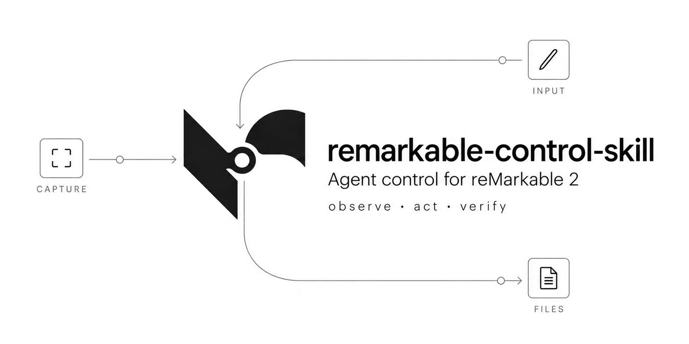

<p align="center">
  
</p>

<h1 align="center">remarkable-control-skill</h1>

<p align="center">
  
  
  
</p>

An agent skill for controlling a reMarkable 2 tablet. It was born out of
my own experiments and wanting some extra tooling on my reMarkable.

My motto for agentic development: your harness is only as strong as the
least observable end state you have. And the reMarkable 2 exposes no
screen recording of any kind. The only solution I could find out of the
box was ScreenShare, which needs a manual connection first and then lets
the agent work. Useless to me, because the development I was doing
restarts the tablet quite often and needs hands-off test suites.

There was no API for any of this, so I reverse-engineered the whole path
under my own guidance, with my AI agents doing the heavy lifting (Codex
Astra 6 and Meta Spark 1.3): how the screen is composed, where the
pixels live, and how to pull them out over plain SSH with nothing installed
on the tablet.

So I did the investigation by hand and built two things that serve each
other:

- **`rm2ctrl`** ([CLI.md](CLI.md)), a small command-line tool that drives
  the tablet: screenshot, tap, swipe, pen drawing, raw SSH. Anything,
  human or agent, can run it.
- **The skill** ([SKILL.md](SKILL.md)), teaches an agent *when* to run
  what: how the screens connect, what to check after each step, and
  the safety rules. The CLI is the hands; the skill is the brain.

## The CLI in 30 seconds

```sh
git clone https://github.com/BedirT/remarkable-control-skill
cd remarkable-control-skill
export PATH="$PWD:$PATH"

rm2ctrl shot --out screen.png   # see the tablet (fast, ~1 s)
rm2ctrl tap 700 936             # tap center
rm2ctrl shot --out verify.png   # prove the tap landed
```

For loops, keep a feed open once and copy frames instantly:

```sh
rm2ctrl live start               # daemon captures every ~2 s
rm2ctrl live shot --out s.png    # local copy, ~0.04 s, no SSH
```

First tablet use also needs the tiny input helper on the device:

```sh
scp scripts/rm2ctrl-input/rm2ctrl-input root@10.11.99.1:/tmp/rm2ctrl-input
```
| Command | What it does |
|---|---|
| `rm2ctrl shot [--out F] [--strict]` | Screenshot, read-only. Fast single check by default (~1 s). `--strict` is the full-hash backup. No taps, no refresh, no setup on the tablet. |
| `rm2ctrl live start / shot / status / stop` | Persistent feed. Daemon captures every ~2 s; `live shot` is an instant local copy for loops. |
| `rm2ctrl tap X Y` | Finger tap at screen pixels (1404×1872). Bad coords rejected before anything runs. |
| `rm2ctrl swipe X1 Y1 X2 Y2` | Finger swipe with a natural, finger-like profile. |
| `rm2ctrl draw FILE.svg --run` | Draws SVG line art with the pen, one pen-down per shape. `--speed 1-5` sets the pace (default 2, careful tracing). Without `--run` it just prints the strokes. |
| `rm2ctrl ssh -- <cmd>` | Escape hatch: a raw command on the tablet. |

```sh
rm2ctrl draw logo.svg --run --box 200 500 1000 700 --skip-fill fff
```

Connection flags work on every command:
`--host`, `--key`, `--timeout` (defaults: USB `root@10.11.99.1`,
`~/.ssh/id_rsa_remarkable`, 5 s). Exit codes: 0 ok, 1 device
failure, 2 bad arguments (nothing touched).

## The skill in 30 seconds

Paste this to your agent:

```text
Install the reMarkable 2 skill from https://github.com/BedirT/remarkable-control-skill:
clone it, put its `rm2ctrl` command on your PATH, follow the README quickstart
to connect over USB SSH, and take a first screen capture to prove the loop works.
```

The skill routes every task through one loop: **observe** (prefer
`rm2ctrl live shot`, else `rm2ctrl shot`), **act** exactly once
(`rm2ctrl tap`/`swipe`/`draw`), **verify** with another screenshot.
E-ink needs ~1 s to settle; state is proven by capture, never assumed.
Start at [SKILL.md](SKILL.md): it routes to seven references (access,
display, input, files, screen map, tooling, loop discipline) and states
the safety rules: never force a refresh, stop xochitl before writing its
files, fail fast, never prompt.

## Why this exists

Nothing on the tablet helps an agent. No screenshot API that survives,
no UI automation layer, no screen recording. So the whole path was
reverse-engineered: where xochitl keeps its composed page and how to
pull it over plain SSH with nothing installed, plus a tiny static
helper that taps, swipes, and draws real pen strokes through kernel
input devices. Every address is pinned per firmware build and
re-verified on every run.

Target is the **reMarkable 2**. Paper Pro differences are flagged
where they matter and never mixed into rM2 procedures.

## Structure

```text
rm2ctrl + CLI.md                control CLI (tap/swipe/shot/live/draw/ssh) + command reference
SKILL.md                        thin router: connect, loop, safety
references/                     01 access & auth, 02 display & screenshot, 03 input,
                                04 files & content, 05 UI/UX map, 06 tooling, 07 autonomy loop
scripts/                        rm2ctrl-capture.py, rm2ctrl-live.py, rm2ctrl-svg.py, rm2ctrl-ssh.sh, rm2ctrl-input/ (Rust helper)
tests/                          host-only suite, incl. test_rm2ctrl.py (no tablet needed)
```

## Contributing

Keep SKILL.md thin: detail belongs in `references/`, runnable code in
`scripts/` behind an `rm2ctrl` subcommand. Ground every command and
path in on-device evidence; mark anything unverified `[INFERENCE]`
and flag Paper Pro deltas instead of mixing them. See [SKILL.md](SKILL.md)
safety rules before adding anything that writes to the display
pipeline or the xochitl tree.
